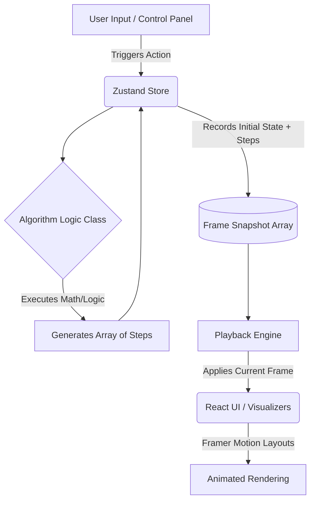

# 🧠 Data Structures & Algorithms Visualizer

An interactive, web-based visualization tool designed to help developers and computer science students understand how data structures and algorithms work under the hood.

## ✨ Features

**Linear Data Structures:** Visualize Arrays, Stacks, Queues, and Linked Lists (Singly & Doubly) with smooth pointer and memory allocation animations.

**Trees & Heaps:** Interactive Binary Search Trees, AVL Trees, Red-Black Trees, Splay Trees, B-Trees, and Min/Max Heaps.

**Hash Tables:** Visualize Open Addressing (Linear, Quadratic, Double Hashing), Linked-List Chaining, and Bucket Hashing with active hashing collision resolution animations.

**Interactive Graphs:**
- Features a drag-and-drop canvas for nodes and edges.
- Toggles for Directed/Undirected and Weighted/Unweighted graphs.
- Representations: Visual Graph, Adjacency Matrix, Adjacency List.

**Algorithm Visualizations:**
- Graph Traversal: BFS, DFS.
- Shortest Path: Dijkstra's Algorithm, Bellman-Ford.
- Minimum Spanning Tree: Prim's Algorithm, Kruskal's Algorithm.
- Graph Ordering: Kahn's Topological Sort.
- Searching: Binary Search, Lower Bound, Upper Bound.
- Sorting: Insertion, Shell, Selection, Bubble, Quick, and Merge Sort (with recursive chunk splitting).

**Playback Engine:** Play, pause, step forward, step backward, and adjust animation speeds dynamically.

## 🛠 Tech Stack

- **Frontend Framework:** React.js
- **State Management:** Zustand (Handles complex frame-by-frame snapshot states for the playback engine)
- **Animations:** Framer Motion (Powers the fluid layout transitions and layoutId bridging)
- **Styling:** Tailwind CSS
- **Icons/Graphics:** SVG-based native rendering

## 🗂 Project File Structure

```
├── src/
│   ├── algorithms/               # Pure logic classes generating execution steps
│   │   ├── graphs.js             
│   │   ├── hash.js               
│   │   ├── heaps.js              
│   │   ├── search.js             
│   │   ├── sorting.js           
│   │   └── trees.js             
│   ├── components/               
│   │   ├── layout/               
│   │   │   ├── LeftControlPanel.jsx # Main user input and algorithm trigger controls
│   │   │   └── MainView.jsx      # Canvas wrapper and toolbar layout
│   │   └── visualizers/          # Framer Motion animated canvases
│   │       ├── GraphVisualizer.jsx
│   │       ├── HashVisualizer.jsx
│   │       ├── HeapVisualizer.jsx
│   │       ├── LinearVisualizer.jsx
│   │       └── TreeVisualizer.jsx
│   ├── store/
│   │   └── useStore.js           # Zustand global state & Frame snapshot engine
│   ├── App.jsx
│   └── main.jsx
├── index.html
├── tailwind.config.js
├── vite.config.js
└── package.json
```

## 🏗 Architecture Flow

The application utilizes a State-Snapshot Playback Architecture. Instead of animating data structures directly as they compute, algorithms are run instantly in the background, generating an array of step-by-step state "Frames". The UI then iterates through these frames using the playback controls.



## 🚀 Installation

Ensure you have Node.js installed on your machine.

Clone the repository:

```bash
git clone https://github.com/yourusername/your-repo-name.git
```

Navigate to the project directory:

```bash
cd your-repo-name
```

Install dependencies:

```bash
npm install
```

## 💻 Run the Project

To start the development server, run:

```bash
npm run dev
```

Open http://localhost:5173 (or the port provided in your terminal) to view the application in the browser.

## 🌍 Deployments

This project is optimized for deployment on Vercel.


## 📄 License

This project is licensed under the MIT License.

You are free to use, modify, and distribute this software for educational purposes, provided that proper
credit is given to the original author.
